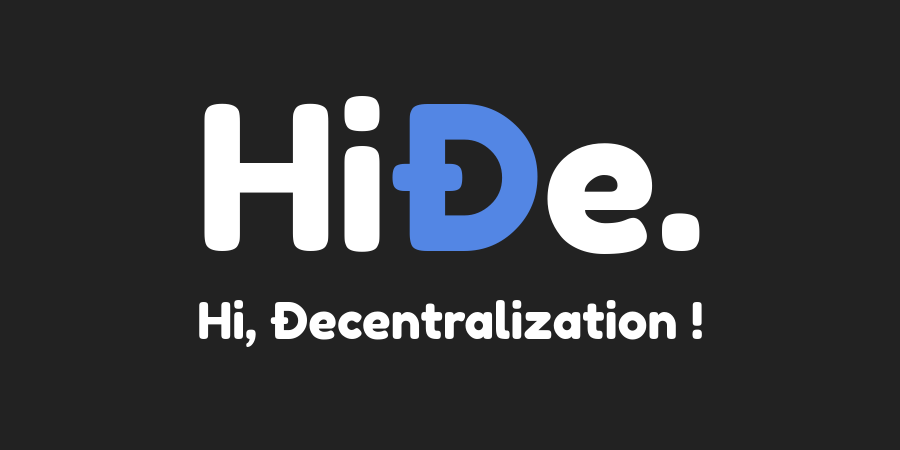

# HiÐΞ | Offline First Decentralized CMS

HiÐΞ is a PWA (Progressive Web App) that lets you manage your articles 100% offline without internet connection.

## Installation

```bash
git clone https://github.com/warashibe/hide.git
cd hide
yarn
```

## Run Local Node (http://localhost:3000)

```bash
yarn dev
```

## Remote Site

You can access the remote running node deployed by [Warashibe](https://github.com/warashibe).

[https://offline.hide.ac](https://offline.hide.ac)

## License
HiÐe. is [MIT licensed](LICENSE).
